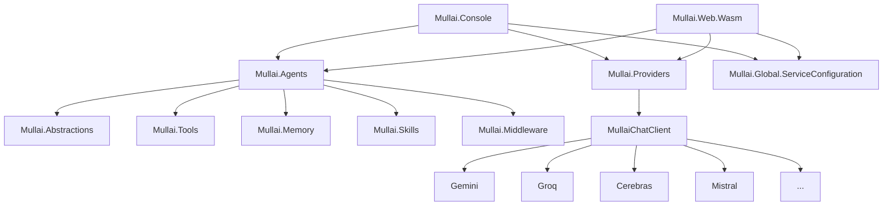

# 🌸 Mullai — AI Assistant

<p align="center">
    <picture>
        
    </picture>
</p>

<p align="center">
  <strong>Your Personal Assistant</strong>
</p>

<p align="center">
  <a href="https://github.com/agentmatters/themullai/stargazers"></a>
  <a href="https://github.com/agentmatters/themullai/actions/workflows/dotnet.yml?branch=main"></a>
  <a href="LICENSE"></a>
</p>


Mullai is a modern, extensible AI Agent framework built on .NET. It leverages `Microsoft.Extensions.AI` and `Microsoft.Agents.AI` to run intelligent, multi-turn AI agents equipped with tools, memory, and skills. 

Whether you want to interact with agents via a robust Console Application or a modern Blazor WebAssembly UI, Mullai provides a highly scalable architecture to build your own AI assistants.

## 🚀 Features

- **Multi-Provider with Automatic Fallback**: `MullaiChatClient` wraps multiple LLM providers (Gemini, Groq, Cerebras, Mistral, OpenRouter, Ollama) in priority order. If one fails, the next is tried automatically — no restarts, no downtime.
- **`models.json` — Centralized Model Catalog**: All provider and model metadata (priority, capabilities, pricing, context window, enabled flag) lives in a single `models.json` file. Switch providers or models by editing JSON — no code changes needed.
- **Extensible Agent Architecture**: Define distinct agent personalities (e.g., "Assistant", "Joker") with customized instructions and toolsets.
- **Rich Tool Ecosystem**: Equip your agents with built-in tools like `WeatherTool`, `CliTool`, and `FileSystemTool`, allowing them to interact with the external world.
- **Middleware Pipeline**: Robust interception of agent interactions via `FunctionCallingMiddleware`, `PIIMiddleware`, and `GuardrailMiddleware`.
- **Memory & Skills**: Persistent `UserInfoMemory` and dynamic skill providers (`FileAgentSkillsProvider`) to give agents context and advanced capabilities.
- **Observability Built-in**: Full OpenTelemetry integration — distributed traces (parent + per-attempt spans), structured logs at every fallback step, and metrics — all tagged with provider name and model ID.
- **Frontend Choices**: 
  - `Mullai.Console` - A fast, interactive CLI host with streaming responses.
  - `Mullai.Web.Wasm` - A modern Blazor WebAssembly web application for a rich user interface.

## 🏗 Project Architecture

Mullai is designed with a modular, decoupled architecture:



### Core Components

- **`Mullai.Agents`**: Central core containing the `AgentFactory` and agent definitions.
- **`Mullai.Tools`**: Exposes capabilities like CLI execution and File System access to the LLM.
- **`Mullai.Middleware`**: Intercepts requests and responses to enforce guardrails, scrub PII, and handle function calling.
- **`Mullai.Providers`**: Pluggable LLM backends unified under `MullaiChatClient` with priority-based fallback.
- **`Mullai.Memory` & `Mullai.Skills`**: Manages conversational history, user context, and dynamic capabilities.
- **`Mullai.Telemetry`**: OpenTelemetry configuration shared across all components.

## ⚙️ Provider Configuration

### `models.json` — Model Catalog

Model and provider metadata is defined in `Mullai.Global.ServiceConfiguration/models.json`. Only API keys live in `appsettings.json`.

```json
{
  "MullaiProviders": {
    "Providers": [
      {
        "Name": "Gemini",
        "Priority": 1,
        "Enabled": true,
        "Models": [
          {
            "ModelId": "gemini-2.5-flash",
            "ModelName": "Gemini 2.5 Flash",
            "Priority": 1,
            "Enabled": true,
            "Capabilities": ["chat", "vision", "tool_use"],
            "Pricing": { "InputPer1kTokens": 0.00015, "OutputPer1kTokens": 0.0006 },
            "ContextWindow": 1048576
          }
        ]
      }
    ]
  }
}
```

**Common operations — no code required:**
| Task | How |
|---|---|
| Disable a provider | Set `"Enabled": false` on the provider |
| Disable a model | Set `"Enabled": false` on the model |
| Change fallback order | Change `Priority` (lower = tried first) |
| Add a model | Add an object to the provider's `Models` array |

### `appsettings.json` — API Keys Only

```json
"Gemini":    { "ApiKey": "" },
"Groq":      { "ApiKey": "" },
"Cerebras":  { "ApiKey": "" },
"Mistral":   { "ApiKey": "" },
"OpenRouter": { "ApiKey": "" }
```

Providers with a missing or empty API key are silently skipped at startup — they won't crash the application.

## 🛠 Getting Started

### Prerequisites

- [.NET 10 SDK](https://dotnet.microsoft.com/download/dotnet/10.0)
- (Optional) Docker for running the OpenTelemetry observability stack.
- An API key for at least one supported provider (Gemini, Groq, Cerebras, Mistral, OpenRouter) or a local Ollama instance.

### Setup and Run

1. **Clone the repository:**
   ```bash
   git clone https://github.com/agentmatters/themullai.git
   cd Mullai
   ```

2. **Configure API keys:**
   Copy `appsettings.sample.json` to `appsettings.json` in `Mullai.Global.ServiceConfiguration` and fill in your API keys.
   ```bash
   cp Mullai.Global.ServiceConfiguration/appsettings.sample.json \
      Mullai.Global.ServiceConfiguration/appsettings.json
   ```

3. **(Optional) Adjust provider priority:**
   Edit `Mullai.Global.ServiceConfiguration/models.json` to enable/disable providers or change their order.

4. **Run the Console Host:**
   ```bash
   cd Mullai.Console
   dotnet run
   ```

5. **Run the Blazor Web App:**
   ```bash
   cd Mullai.Web.Wasm/Mullai.Web.Wasm
   dotnet run
   ```

## 📊 Observability

Mullai includes an OpenTelemetry stack defined in the `docker/` folder (Jaeger + Prometheus). `MullaiChatClient` emits:

- **Distributed traces** — a parent span per request and a child span per provider attempt, both tagged with `mullai.provider`, `mullai.model`, `mullai.attempt`, `mullai.duration_ms`, and `mullai.success`.
- **Structured logs** — `Information` on startup and each attempt, `Warning` on fallback, `Error` when all providers fail.

## 🤝 Contributing

Contributions are welcome! Whether it's adding new tools, middlewares, or improving the Blazor UI:
1. Fork the repository.
2. Create your feature branch (`git checkout -b feature/NewTool`).
3. Commit your changes (`git commit -m 'Add some NewTool'`).
4. Push to the branch (`git push origin feature/NewTool`).
5. Open a Pull Request.

## 📄 License

This project is licensed under the MIT License.
